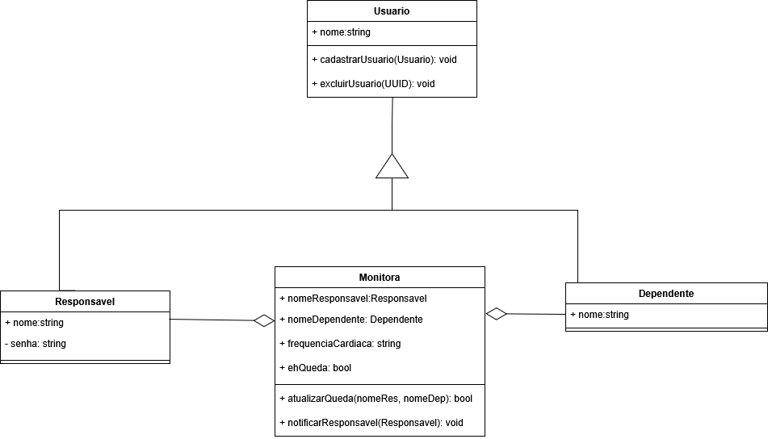
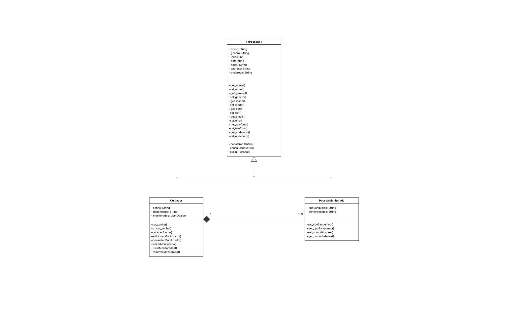

# 2.1. Módulo Notação UML – Modelagem Estática

---

## Diagrama de Classes

Um diagrama de classes UML é uma ferramenta fundamental para a modelagem de sistemas orientados a objetos e é um dos seis modelos de diagramas estruturais. Dependendo da complexidade do sistema, é possível fazer apenas um diagrama de classes para modelar o sistema inteiro ou vários diagramas para modelar os componentes do sistema.

Como será visto mais adiante neste projeto, utilizamos um único diagrama de classes para representar nosso sistema. O diagrama de classes tem o objetivo de modelar objetos de um sistema ou subsistema, exibindo as relações entre eles e descrevendo suas funcionalidades e os serviços que fornecem. Ao final de sua concepção, apresenta-se uma estrutura estática do sistema, visualizando-se as classes, seus atributos, métodos e as relações entre elas. [[1]](#ref1)

 

### Versão 1.0

**Esboço inicial do diagrama de classes:**

- Criação da classe `Usuario`.
- Criação da classe `Responsavel`, que herda de `Usuario`.
- Criação da classe `Dependente`, que herda de `Usuario`.
- Criação da classe `Monitora`, que herda tanto de `Responsavel` quanto de `Dependente`.

 

 

### Versão 1.1

**Esboço revisado do diagrama de classes:**

- Criação da classe `Pessoa`.
- Criação da classe `Cuidador`, que herda de `Pessoa`.
- Criação da classe `Pessoa Monitorada`, que herda de `Pessoa`.
- Definição da relação de 1 para N entre `Cuidador` e `Pessoa Monitorada`.

 

 

---

## Estrutura de Classes

A seguir, apresenta-se o diagrama de classes gerado no Lucidchart, que descreve os principais elementos da arquitetura orientada a objetos do sistema.

<iframe allowfullscreen frameborder="0" style="width:960px; height:720px" src="https://lucid.app/documents/embedded/8ea1f81d-cfdf-4869-a539-583aea7102ef" id="D8RdfbWlaboS"></iframe>

# Apagar Para entrega, Observações

Foco_1: Modelagem UML Estática.

Entrega Mínima: 1 Modelo Estático (ESCOPO: Diagrama de Classes; Diagrama de Componentes ou Diagrama de Implantação).

Apresentação (para a professora) explicando o modelo estático especificado, com: (i) rastro claro aos membros participantes (MOSTRAR QUADRO DE PARTICIPAÇÕES & COMMITS); (ii) justificativas & senso crítico sobre o modelo, e (iii) comentários gerais sobre o trabalho em equipe. Tempo da Apresentação: +/- 5min. Recomendação: Apresentar diretamente via Wiki ou GitPages do Projeto. Baixar os conteúdos com antecedência, evitando problemas de internet no momento de exposição nas Dinâmicas de Avaliação.

A Wiki ou GitPages do Projeto deve conter um tópico dedicado ao Módulo Modelagem Estática (Notação UML), com 1 modelo, histórico de versões, referências, e demais detalhamentos gerados pela equipe nesse escopo.

## Referências 

[[1]](#diagrama-de-classes) Material Complementar - Modelagem UML. Disponível em: [[Aprender3]](https://aprender3.unb.br/pluginfile.php/3075176/mod_page/content/1/Material%20Complementar%20T%C3%B3pico%202%20-%20DSW%20-%20Modelagem%20A.zip). Acesso em: 7 maio 2025.

## Histórico de Versões

| Versão | Commit da Versão | Data       | Descrição                                                                                      | Autor(es)                                                   | Revisor(es)                                  | Descrição da Revisão                  | Commit da Revisão        |
|:------:|:----------------:|:----------:|:-----------------------------------------------------------------------------------------------:|:-----------------------------------------------------------:|:--------------------------------------------:|:------------------------------------:|:-------------------------:|
| 0.1    | [Ver Commit](https://github.com/UnBArqDsw2025-1-Turma01/2025.1-T01-_G1_Embarcado_Entrega_02/commit/a937432632e45ab878b4c384f2f5e47229cf08a1) | 07/05/2025 | Adição da referência - Modelagem UML (Diagrama de Classes) | [Altino Arthur](https://github.com/arthurrochamoreira)       | [Revisor](https://github.com/)               | *(Inserir observações da revisão)*  | [Ver Commit](https://github.com/) |
| 0.2   | [Ver Commit](https://github.com/UnBArqDsw2025-1-Turma01/2025.1-T01-_G1_Embarcado_Entrega_02/commit/6b623eca267cf26cbdb600362dfa37d20c565696) | 08/05/2025 | Adiciona diagrama de classes v1.1; corrige imagem da versão 1.0; adiciona embed do Lucidchart | [Altino Arthur](https://github.com/arthurrochamoreira) e [Daniel de Sousa](https://github.com/daniel-de-sousa) | [Revisor](https://github.com/) | *(Inserir observações da revisão)* | [Ver Commit](https://github.com/) |

<!-- Copie a descomente linha abaixo para adicionar novas versões -->

<!-- |        |                  |            |                                                     |                                                           |                                              |                                 |                                 | -->
