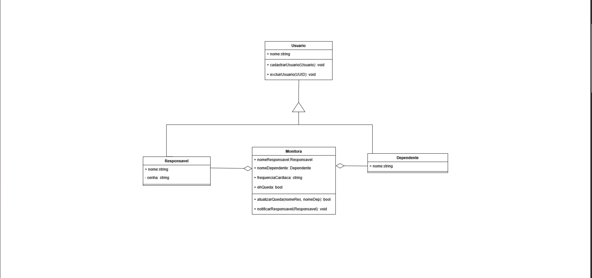

# 2.1. Módulo Notação UML – Modelagem Estática

----

## Diagrama de Classes

Um diagrama de classes UML é uma ferramenta fundamental para a modelagem de sistemas orientados a objetos e é um dos seis modelos de diagramas estruturais. Dependendo da complexidade do sistema, é possível fazer apenas um diagrama de classes para modelar o sistema inteiro ou vários diagramas para modelar os componentes do sistema. Como será visto mais adiante nesse projeto, utilizamos um único diagrama de classes para representar nosso sistema. O diagrama de classes tem o objetivo de modelar objetos de um sistema ou subsistema, assim exibindo as relações que eles têm e descrevendo o que cada objeto faz e o serviço que eles fornecem. E ao final de sua concepção é apresentado uma estrutura estática de um sistema, visualização as classes, seus atributos, métodos e as relações entre elas.

### Versão 1.0

1. Esboço inicial do diagrama de classe
- criação da classe Usuario.
- criação da classe Responsavel que herda de Usuario.
- criação da classe Dependente que herda de Usuario.
- criação da classe Monitora, que herda tanto de Responsavel quanto Dependente.

 

# Apagar Para entrega, Observações

Foco_1: Modelagem UML Estática.

Entrega Mínima: 1 Modelo Estático (ESCOPO: Diagrama de Classes; Diagrama de Componentes ou Diagrama de Implantação).

Apresentação (para a professora) explicando o modelo estático especificado, com: (i) rastro claro aos membros participantes (MOSTRAR QUADRO DE PARTICIPAÇÕES & COMMITS); (ii) justificativas & senso crítico sobre o modelo, e (iii) comentários gerais sobre o trabalho em equipe. Tempo da Apresentação: +/- 5min. Recomendação: Apresentar diretamente via Wiki ou GitPages do Projeto. Baixar os conteúdos com antecedência, evitando problemas de internet no momento de exposição nas Dinâmicas de Avaliação.

A Wiki ou GitPages do Projeto deve conter um tópico dedicado ao Módulo Modelagem Estática (Notação UML), com 1 modelo, histórico de versões, referências, e demais detalhamentos gerados pela equipe nesse escopo.
