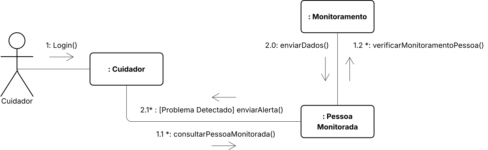

# Diagrama de Comunicação – Sistema de Monitoramento de Idosos

O **Diagrama de Comunicação** é um tipo de diagrama da UML que ilustra a **interação entre objetos** ou **partes do sistema**, destacando a **ordem e o fluxo de mensagens** trocadas entre eles. Ele funciona de maneira similar a um **fluxograma**, mas com foco na **troca sequencial de mensagens** entre os elementos envolvidos em um **cenário específico** (normalmente derivado de um caso de uso).

Este tipo de diagrama:

- Representa **objetos** e seus **relacionamentos**;
- Mostra **mensagens numeradas** para indicar a **sequência** de ações;
- Pode conter **condições**, **respostas**, **interações paralelas** e **objetos ativos**;
- Destaca o **contexto estrutural** do sistema mais do que a evolução temporal.

> Esse diagrama é bem parecido com o de sequência, mas como o objetivo aqui é ilustrar o **contexto e estrutura das interações** em vez de ilustrar **o que acontece ao longo do tempo**, o **Diagrama de Comunicação** é mais indicado em vez do de diagrama de sequência **Diagrama de Sequência** [[1]](#ref1).

---

Para começar a construir o diagrama, é interessante antes identificar suas partes que vão o compor, para isso, pode vez os [Casos de Uso](2.3.1.CasosDeUso.md) e entender os fluxos possíveis dentro do sistema, como também o [Diagrama de Classes](2.1.ModelagemEstatica.md).

## Legenda do Diagrama

- **Objetos**: Representados por retângulos com nomes prefixados com dois-pontos `(:)`.
- **Mensagens**: Mostradas como linhas com setas e numeradas para indicar ordem.
- **Atores**: Elementos externos ao sistema que interagem com ele.

## Atores

| Ator                  | Descrição                                                                 |
|-----------------------|---------------------------------------------------------------------------|
| **Cuidador**          | Usuário principal do sistema. Realiza ações como login, cadastro de idosos, visualização e edição de informações. |
<!--| **Pessoa Monitorada** | Idoso que carrega o dispositivo. Seu papel é passivo, enviando dados automaticamente ao sistema. |-->

---

## Objetos Internos 

| Objeto                   | Responsabilidade |
|--------------------------|------------------|
| `:Cuidador`              | Centraliza as ações solicitadas pelo Cuidador. |
| `:PessoaMonitorada`      | Gerencia as pessoas que serão monitoradas pelo Cuidador. |
| `:Monitoramento`         | Representação lógica de monitoramento das pessoas que serão cuidadas. |

## Fluxo de Mensagens

Abaixo está o cenário **funcional** que se inicia **após o login do cuidador** focando especificamente em como ele verifica as pessoas sobre seus cuidados e recebe alertas:

### Fluxo 1

1️⃣ `Ator → :Cuidador`  
**login()** – O cuidador se autentica no sistema.

2️⃣ `:Cuidador → :PessoaMonitorada`  
**consultarPessoaMonitorada()`** – Inicia uma Consulta para saber como está uma pessoa em específico.

3️⃣ `PessoaMonitorada → :Monitoramento`  
**verificarMonitoramentoPessoa()`** – Recebe os dados de monitoramento de uma pessoa em específico.

### FLuxo 2

4️⃣ `Monitoramento → :PessoaMonitorada`  
**enviarDados()`** – Atualiza informações de um monitorado.

5️⃣ `PessoaMonitorada → :Cuidador`  
**enviarAlerta()`** – Se necessário, com base nos dados, envia um alerta para o cuidador.

Com tudo isso se pode criar a versão 1.0 abaixo.

### Versão 1.0

 

 

Incorporação do Lucidchart:

<iframe style="border: 1px solid rgba(0, 0, 0, 0.1);" width="800" height="800" src="https://lucid.app/documents/embedded/73f1fded-358c-41e2-b669-7e7e0159d7b1" id="33~dyJP3TMCZ" allowfullscreen></iframe>

## Referências 

[[1]](#diagrama-de-classes) Material Complementar - Modelagem UML. Disponível em: [[Aprender3]](https://aprender3.unb.br/pluginfile.php/3075176/mod_page/content/1/Material%20Complementar%20T%C3%B3pico%202%20-%20DSW%20-%20Modelagem%20A.zip). Acesso em: 9 maio 2025.

Relacionamento entre Atores e Casos de Uso: Estabelecemos as interações entre os atores e os casos de uso, utilizando relações de inclusão e extensão quando necessário.

Foco_3: Modelagem Organizacional OU Casos de Uso.

Entrega Mínima: 1 Modelo, sendo esse o Diagrama de Pacotes ou o Diagrama de Casos de Uso.

Apresentação (para a professora) explicando o modelo especificado, com: (i) rastro claro aos membros participantes (MOSTRAR QUADRO DE PARTICIPAÇÕES & COMMITS); (ii) justificativas & senso crítico sobre o modelo, e (iii) comentários gerais sobre o trabalho em equipe. Tempo da Apresentação: +/- 5min. Recomendação: Apresentar diretamente via Wiki ou GitPages do Projeto. Baixar os conteúdos com antecedência, evitando problemas de internet no momento de exposição nas Dinâmicas de Avaliação.

A Wiki ou GitPages do Projeto deve conter um tópico dedicado ao Módulo Modelagem Organizacional/Casos de Uso (Notação UML), com 1 modelo, histórico de versões, referências, e demais detalhamentos gerados pela equipe nesse escopo.

## Histórico de Versões

| Versão | Commit da Versão | Data       | Descrição                                           | Autor(es)                                                  | Revisor(es)                                  | Descrição da Revisão              | Commit da Revisão        |
|:------:|:----------------:|:----------:|:---------------------------------------------------:|:-----------------------------------------------------------:|:--------------------------------------------:|:-------------------------------:|:-------------------------------:|
| 0.1    | [Ver Commit](https://github.com/)         | 07/05/2025 | Adição do item "Histórico de Versões"      | [Altino Arthur](https://github.com/arthurrochamoreira)      | [Revisor](https://github.com/)               | Ajustes gramaticais e formatação | [Ver Commit](https://github.com/) |
| 1.0    | [Ver Commit](https://github.com/UnBArqDsw2025-1-Turma01/2025.1-T01-_G1_Embarcado_Entrega_02/commit/ce2eba63cb2305e27740ea5283f3cc5a3afc526c) | 09/05/2025 | Adição da Primeira Versão do Diagrama de Comunicação | [Daniel de Sousa](https://github.com/daniel-de-sousa)       | [Revisor](https://github.com/)               |                                  | [Ver Commit](https://github.com/) | 

<!-- Copie a descomente linha abaixo para adicionar novas versões -->

<!-- |        |                  |            |                                                     |                                                           |                                              |                                 |                                 | -->
