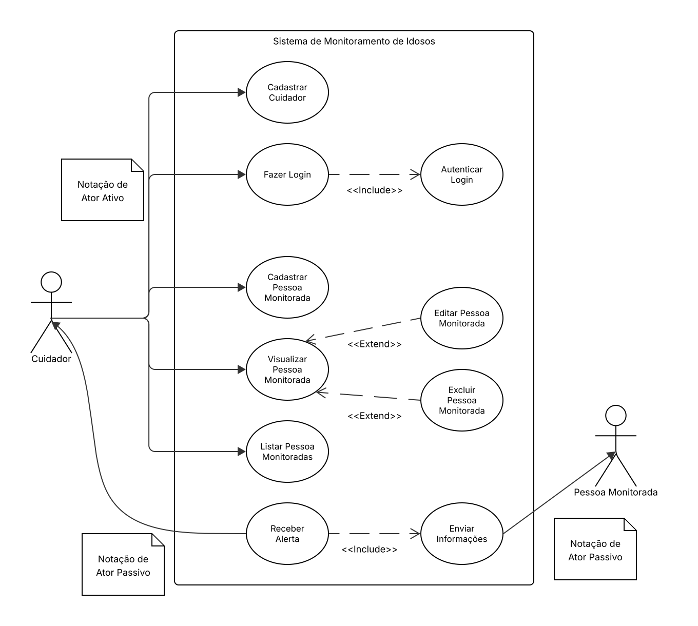

# 2.3.1 Casos de Uso

## Modelo de Casos de Uso

O **modelo de Casos de Uso** faz parte do modelo **organizacional** e tem como objetivo principal descrever **quem faz o quê no sistema**. Ele permite identificar, de forma visual e estruturada, **quais tarefas são realizadas por quais atores**.

> Todas as informações a seguir foram baseadas nas aulas da Prodfessora Milene de Arquitetura e Desenho de Software e no livro _[Engenharia de Requisitos: Software Orientado ao Negócio](#ref1)_.

## Objetivos do Modelo

- Identificar as **interações entre usuários e o sistema**.
- Descrever **funcionalidades** que o sistema deve oferecer.
- Fornecer uma **visão geral de alto nível** sobre o comportamento do sistema.

## Elementos do Diagrama de Casos de Uso

| Elemento         | Descrição                                                                                       |
|------------------|-------------------------------------------------------------------------------------------------|
|  **Atores**     | Entidades (usuários, sistemas ou dispositivos) que interagem com o sistema para alcançar um objetivo. |
|  **Casos de Uso** | Funcionalidades ou serviços prestados pelo sistema em resposta às ações dos atores.                |
|  **Relacionamentos** | Representam como os atores interagem com os casos de uso e como os casos de uso se relacionam entre si. |

## Limitações do Diagrama de Casos de Uso

O diagrama de casos de uso **não descreve**:

-  A **sequência de passos** necessária para realizar um caso de uso.
-  As **regras de negócio** envolvidas.
-  A **orquestração entre diferentes casos de uso**.
-  A forma como os comportamentos são implementados em hardware ou software.
-  A **implementação em linguagem de programação**.

> Em resumo, trata-se de um modelo que descreve **o que** o sistema deve fazer, e **não como** ele deve fazer.

---

## Descrição do Caso de Uso

### Nome: **Sistema de Monitoramento de Idosos**

### Atores Envolvidos

- **Cuidador** (**Ator Primário**): Responsável por cadastrar e monitorar as pessoas assistidas. Ele interage diretamente com o sistema.
- **Pessoa Monitorada** (**Ator Secundário**): Indivíduo que utiliza o dispositivo de monitoramento. Interage de forma indireta com o sistema, enviando dados automaticamente.

Para a modelagem, utilizamos as seguintes definições para alguns relacionamentos dos **atores**, que vai ser indetificado no modelo:

- **Ator Ativo**: Aquele que **inicia a interação com o sistema**, solicitando algum comportamento ou funcionalidade.  
  - Exemplo: *Cuidador*, que realiza ações como cadastrar.
  
- **Ator Passivo**: Aquele que **participa do processo**, mas **não inicia ações diretamente**. Interage de forma indireta ou automática.  
  - Exemplo: *Pessoa Monitorada*, que apenas envia informações ao sistema via hardware.

> Cuidador vai se enquadrar como Ator Passivo também, no relacionamento onde ele ele poderá receber um alerta sobre algum dos idosos que está cuidando.

### ⚙️ Casos de Uso Identificados

| Caso de Uso                      | Descrição                                                                                                        |
|----------------------------------|------------------------------------------------------------------------------------------------------------------|
| **Cadastrar Cuidador**           | Permite que um cuidador crie sua conta no sistema.                                                               |
| **Fazer login**                  | O cuidador pode acessar sua conta com suas credenciais.                                                          |
| **Autenticar Login**             | O sistema valida as credenciais fornecidas no login.                                                             |
| **Trocar Senha**           | Permite que o cuidador troque sua senha sistema.
| **Cadastrar Pessoa Monitorada**  | Permite cadastrar uma ou mais pessoas sob os cuidados do cuidador.                                               |
| **Visualizar Pessoa Monitorada** | Exibe os dados de uma pessoa cadastrada para o cuidador e qual a situação dela naquele momento.                  |
| **Editar Pessoa Monitorada**     | Permite modificar os dados de uma pessoa já cadastrada.                                                          |
| **Excluir Pessoa Monitorada**    | Remove o cadastro de uma pessoa monitorada que não está mais sob cuidados.                                       |
| **Listar Pessoas Monitoradas**   | Exibe a lista completa de pessoas cadastradas pelo cuidador.                                                     |
| **Receber Alerta**               | O sistema notifica o cuidador caso alguma anormalidade seja detectada.                                           |
| **Enviar Informações**           | O dispositivo da pessoa monitorada envia dados continuamente ao sistema.                                         |

---

Com todas essa informações o artefato de casos de uso foi montado e pode ser visto na versão 1.0 abaixo.

### Versão 1.0

 

 

### Versão 2.0

- Associação: Cuidador — Trocar Senha

 

 

Incorporação do Lucidchart:

<iframe style="border: 1px solid rgba(0, 0, 0, 0.1);" width="800" height="800" src="https://lucid.app/documents/embedded/8a752f64-27f9-469e-8abb-72cee0942c3b" id="b73dKaBj~klk" allowfullscreen></iframe>

## Referências 

[[1]](#modelo-de-casos-de-uso) VAZQUEZ, Carlos Eduardo; SIMÕES, Guilherme Siqueira. Engenharia de Requisitos: Software Orientado ao Negócio. Rio de Janeiro: Brasport, 2016. Acesso em: 8 maio 2025. Disponível em: [[Google]](https://www.kufunda.net/publicdocs/Engenharia%20de%20Requisitos%20software%20orientado%20ao%20neg%C3%B3cio%20(Carlos%20Eduardo%20Vazquez%20etc.).pdf)

Relacionamento entre Atores e Casos de Uso: Estabelecemos as interações entre os atores e os casos de uso, utilizando relações de inclusão e extensão quando necessário.

Foco_3: Modelagem Organizacional OU Casos de Uso.

Entrega Mínima: 1 Modelo, sendo esse o Diagrama de Pacotes ou o Diagrama de Casos de Uso.

Apresentação (para a professora) explicando o modelo especificado, com: (i) rastro claro aos membros participantes (MOSTRAR QUADRO DE PARTICIPAÇÕES & COMMITS); (ii) justificativas & senso crítico sobre o modelo, e (iii) comentários gerais sobre o trabalho em equipe. Tempo da Apresentação: +/- 5min. Recomendação: Apresentar diretamente via Wiki ou GitPages do Projeto. Baixar os conteúdos com antecedência, evitando problemas de internet no momento de exposição nas Dinâmicas de Avaliação.

A Wiki ou GitPages do Projeto deve conter um tópico dedicado ao Módulo Modelagem Organizacional/Casos de Uso (Notação UML), com 1 modelo, histórico de versões, referências, e demais detalhamentos gerados pela equipe nesse escopo.

## Histórico de Versões

| Versão | Commit da Versão | Data       | Descrição                                           | Autor(es)                                                  | Revisor(es)                                  | Descrição da Revisão              | Commit da Revisão        |
|:------:|:----------------:|:----------:|:---------------------------------------------------:|:-----------------------------------------------------------:|:--------------------------------------------:|:-------------------------------:|:-------------------------------:|
| 0.1    | [Ver Commit](https://github.com/)         | 07/05/2025 | Adição do item "Histórico de Versões"      | [Altino Arthur](https://github.com/arthurrochamoreira)      | [Revisor](https://github.com/)               | Ajustes gramaticais e formatação | [Ver Commit](https://github.com/) |
| 1.0    | [Ver Commit](https://github.com/UnBArqDsw2025-1-Turma01/2025.1-T01-_G1_Embarcado_Entrega_02/commit/ce2eba63cb2305e27740ea5283f3cc5a3afc526c) | 09/05/2025 | Adição da Primeira Versão dos Casos de Uso | [Daniel de Sousa](https://github.com/daniel-de-sousa)       | [Altino Arthur](https://github.com/arthurrochamoreira)               |   Correção do link quebrado da ref1;                               | [Ver Commit](https://github.com/UnBArqDsw2025-1-Turma01/2025.1-T01-_G1_Embarcado_Entrega_02/commit/00d9cc6428e49d283abbcb2a7576bb6b5f98b6cb) | 
| 2.0    | [Ver Commit](https://github.com/UnBArqDsw2025-1-Turma01/2025.1-T01-_G1_Embarcado_Entrega_02/commit/08cc1f0a1107569c65343ea74b456022faafd0d7)         | 09/05/2025 | Adição do item "Versão 2.0 - Casos de Uso"      | [Altino Arthur](https://github.com/arthurrochamoreira)      | [Revisor](https://github.com/)               |  | [Ver Commit](https://github.com/) |

<!-- Copie a descomente linha abaixo para adicionar novas versões -->

<!-- |        |                  |            |                                                     |                                                           |                                              |                                 |                                 | -->
